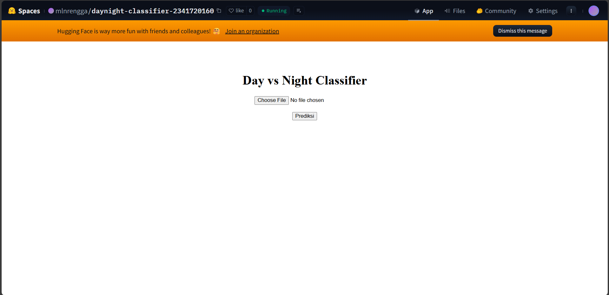
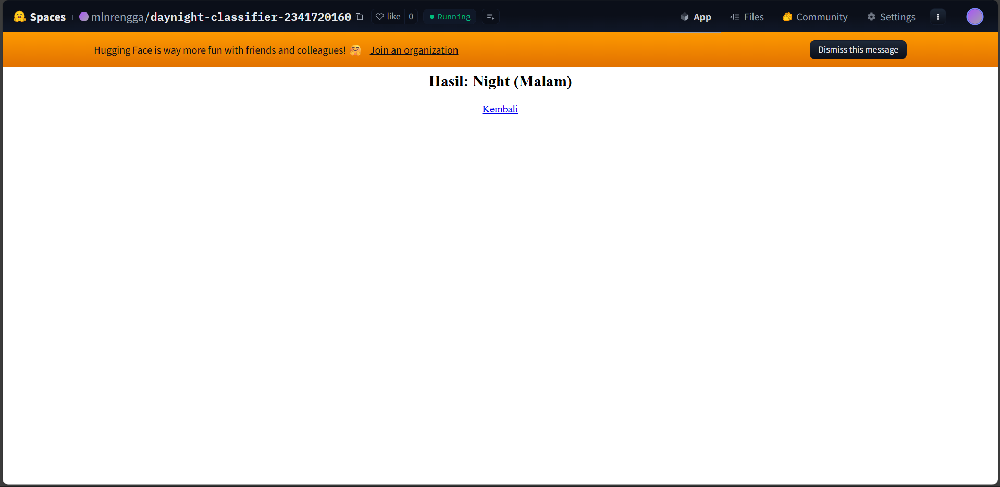

# Day vs Night Classifier

Aplikasi web untuk mengklasifikasikan gambar menjadi kategori **Siang (Day)** atau **Malam (Night)** menggunakan deep learning.

## 🚀 Fitur

- Upload gambar dalam format JPG/JPEG/PNG
- Prediksi otomatis menggunakan model CNN
- Interface sederhana dan user-friendly
- Hasil prediksi dalam Bahasa Indonesia

## 📸 Tampilan Aplikasi

### Halaman Upload

- Pengguna dapat memilih file gambar menggunakan tombol "Choose File"
- Klik tombol "Prediksi" untuk melakukan klasifikasi

### Halaman Hasil

- Menampilkan hasil prediksi: **Day (Siang)** atau **Night (Malam)**
- Tombol "Kembali" untuk mengunggah gambar lain

## 🛠️ Teknologi

- **Framework**: Flask (Python)
- **Model**: CNN dengan TensorFlow/Keras
- **Deployment**: Docker + Hugging Face Spaces
- **File Model**: `day_night_model.h5`

## 📦 Instalasi Lokal

```bash
# Clone repository
git clone <repository-url>
cd daynight-classifier-2341720160

# Install dependencies
pip install -r requirements.txt

# Run aplikasi
python app.py
```

## 🐳 Docker

```bash
# Build image
docker build -t daynight-classifier .

# Run container
docker run -p 7860:7860 daynight-classifier
```

## 📝 Cara Penggunaan

1. Buka aplikasi di browser
2. Klik tombol **"Choose File"** untuk memilih gambar
3. Klik tombol **"Prediksi"**
4. Lihat hasil klasifikasi (Day/Night)
5. Klik **"Kembali"** untuk prediksi gambar lain

## 👨‍💻 Developer

**NIM**: 2341720160

## 📄 License

Apache-2.0 License
