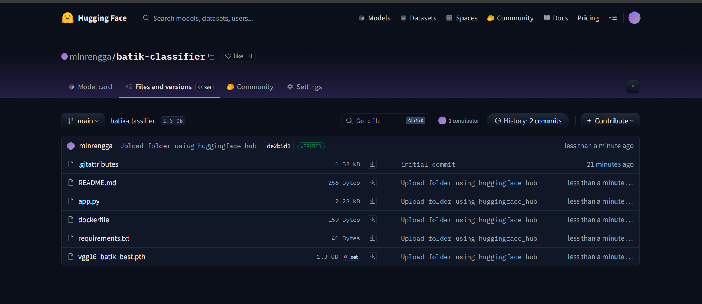

# 🎨 Klasifikasi Motif Batik Indonesia

Sistem klasifikasi motif batik Indonesia menggunakan **VGG16 Deep Learning Model** dengan PyTorch. Model ini dapat mengidentifikasi berbagai motif batik tradisional dari berbagai daerah di Indonesia.



## 📊 Dataset

Dataset terdiri dari **111 motif batik** dari berbagai daerah di Indonesia, mencakup:
- Batik Jawa (Parang, Kawung, Sido Mukti, dll)
- Batik Pekalongan (Mega Mendung, Jlamprang, dll)
- Batik Solo & Yogyakarta
- Batik Cirebon
- Dan motif tradisional lainnya

## 🏗️ Arsitektur Model

- **Base Model:** VGG16 (Pre-trained on ImageNet)
- **Framework:** PyTorch
- **Input Size:** 224x224 pixels
- **Output:** 111 classes (motif batik)
- **Model Size:** 1.3 GB

## 🚀 Cara Menggunakan

### Option 1: Online Demo
Kunjungi [Hugging Face Space](ss1.png) untuk mencoba langsung di browser.

### Option 2: Run Locally

```bash
# Clone repository
git clone https://huggingface.co/mlnrengga/batik-classifier
cd batik-classifier

# Install dependencies
pip install -r requirements.txt

# Run application
python app.py
```

Aplikasi akan berjalan di `http://localhost:7860`

### Option 3: Python API

```python
import torch
from torchvision import transforms, models
from PIL import Image

# Load model
device = torch.device('cuda' if torch.cuda.is_available() else 'cpu')
model = models.vgg16(pretrained=False)
model.classifier[6] = torch.nn.Linear(4096, 111)
model.load_state_dict(torch.load('vgg16_batik_best.pth', map_location=device))
model.eval()

# Preprocessing
transform = transforms.Compose([
    transforms.Resize((224, 224)),
    transforms.ToTensor(),
    transforms.Normalize(mean=[0.485, 0.456, 0.406], 
                        std=[0.229, 0.224, 0.225])
])

# Predict
image = Image.open('batik_image.jpg')
input_tensor = transform(image).unsqueeze(0).to(device)

with torch.no_grad():
    outputs = model(input_tensor)
    probabilities = torch.nn.functional.softmax(outputs, dim=1)
    confidence, predicted = torch.max(probabilities, 1)

print(f"Predicted Class: {predicted.item()}")
print(f"Confidence: {confidence.item()*100:.2f}%")
```

## 📦 Requirements

```
gradio
torch
torchvision
Pillow
numpy
```

## 🎯 Performance

- **Accuracy:** [TODO: Tambahkan akurasi model]
- **Inference Time:** ~0.5 detik per gambar (CPU)
- **GPU Accelerated:** Ya (CUDA support)

## 📸 Screenshots

### Web Interface
Upload gambar batik dan dapatkan prediksi motif beserta confidence score secara real-time.

### Features
- ✅ Upload gambar batik (JPG, PNG)
- ✅ Prediksi otomatis dengan confidence score
- ✅ Mendukung 111 motif batik Indonesia
- ✅ Interface user-friendly dengan Gradio
- ✅ GPU acceleration support

## 🛠️ Tech Stack

- **Deep Learning:** PyTorch, TorchVision
- **Web Framework:** Gradio
- **Model Architecture:** VGG16 (Transfer Learning)
- **Deployment:** Hugging Face Model Repository

## 📝 License

MIT License - Lihat file [LICENSE](LICENSE) untuk detail.

## 👨‍💻 Author

**Maulana Rengga Ramadan** - [@mlnrengga](https://huggingface.co/mlnrengga)

## 🙏 Acknowledgments

- Dataset batik dari berbagai sumber
- Pre-trained VGG16 from PyTorch Model Zoo
- Hugging Face untuk platform hosting

---

**Note:** Model ini dibuat untuk tujuan edukasi dan penelitian. Untuk penggunaan komersial, mohon hubungi author terlebih dahulu.
